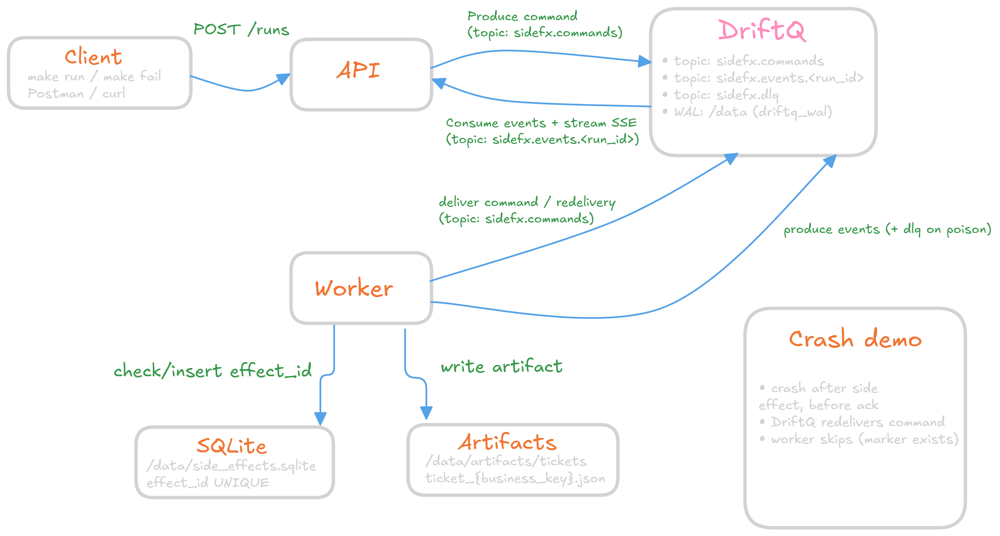

# DriftQ Side-Effects Starter (idempotency + safe retries)

This repo is a **production-ish** starter that proves a real claim:

> **Retries won’t duplicate side effects** — even if the worker crashes mid-step and DriftQ redelivers the message.

It’s for engineers building real systems (payments, webhooks, LLM calls, tickets) who are asking:
**“How do I prevent double-charging / double-webhooking when retries happen?”**

✅ This repo shows one clean pattern: **durable queue + idempotent worker + exactly-once markers**.


## What you get

- **DriftQ** as the durable middle layer (commands/events live there)
- A thin **API** that creates “runs” and publishes commands to DriftQ
- A **worker** that:
  - consumes commands (with redelivery)
  - executes the “side effect”
  - records an **exactly-once marker** in a SQLite store so duplicates get skipped
  - writes a simple “proof artifact” file you can eyeball


## Architecture


The key: the worker is safe to retry because it checks/records a stable **effect_id** before doing the side effect.


## Quickstart 🔥

### Option A: Make (recommended)

```bash
make up
```

### Option B: Python scripts (works everywhere)

```bash
python scripts/dev_up.py --detached
```

When it’s up:

- **API docs:** http://localhost:8000/docs
- **API health:** http://localhost:8000/healthz
- **DriftQ health:** http://localhost:8080/v1/healthz

Logs:

```bash
make worker-logs
# or:
docker compose logs -f worker
```

Stop:

```bash
make down
# or:
python scripts/dev_down.py
```

Wipe everything (including DriftQ WAL + SQLite store):

```bash
make wipe
# or:
python scripts/dev_down.py --wipe --yes
```

## The two demos (run these in order)

### 1) Happy path with a real retry (no chaos)

This forces **one failure BEFORE the side effect**, then succeeds on retry.

```bash
make run
```

What you should see in worker logs:
- attempt 0: fails (before side effect)
- attempt 1: side effect runs, store marked **done**, run completes

Debug endpoints:
- side effect rows: http://localhost:8000/debug/side-effects
- artifacts list: http://localhost:8000/debug/artifacts

### 2) Chaos mode: crash mid-step (the scary one)

This is the “killer demo”.

It does the side effect, then the worker **crashes on purpose before ack**.
DriftQ redelivers the command. The worker comes back up.
And the side effect does **NOT** run twice.

```bash
make fail
```

You should still see **one** side effect row + **one** artifact file.


## How the idempotency story works

### Stable idempotency key (the whole point)

We use a stable key like:

```
effect_id = run_id:step_id:business_key
```

Examples:
- `run_id` = the run
- `step_id` = `"charge_card"` (or `"send_webhook"` / `"create_ticket"`)
- `business_key` = your real-world key (order_id / payment_intent / ticket_id)

The worker stores that `effect_id` in SQLite. If the message comes again:
- row exists → we skip the side effect
- row doesn’t exist → we run it and mark done

### Why we keep this logic out of the API

Putting “exactly-once” inside request handlers turns into pain fast:
- ad-hoc retries everywhere
- partial side effects
- “did it run?” becomes DB archaeology
- you slowly reinvent a workflow engine in your HTTP layer 😬

This repo keeps the API thin and puts durable behavior in:
- **DriftQ** (commands/events + redelivery)
- **worker** (retries + idempotent side effects)
- **SQLite store** (exactly-once markers)


## Where the proof lives

We write a “ticket file” (fake webhook/ticket) under `/data/artifacts/` (Docker volume),
and record a row in `/data/side_effects.sqlite`.

So you get:
- **DB proof** (authoritative)
- **file proof** (easy to eyeball)


## Useful knobs

- `DRIFTQ_IMAGE` (docker-compose):
  - default: `ghcr.io/driftq-org/driftq-core:latest`
  - pin to a version if you want reproducible demos: `...:1.1.0`
- `DRIFTQ_HTTP_URL` (api + worker): defaults to `http://driftq:8080` in compose
- `WORKER_GROUP`: consumer group for the worker (defaults in compose)


## Integrate into your app

Read: `docs/INTEGRATE_IN_YOUR_APP.md`

It’s the playbook for bolting this pattern onto a real app without turning your API into a workflow engine.


## DriftQ-Core (the engine)

This starter is intentionally focused and tiny-ish.
For the engine + roadmap + latest changes:

https://github.com/driftq-org/DriftQ-Core
